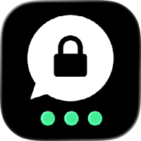
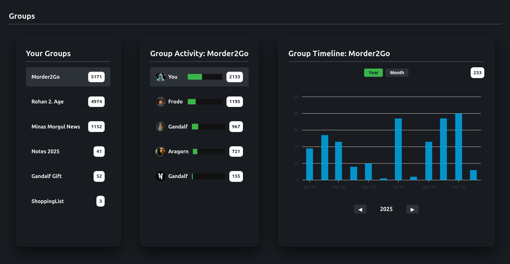
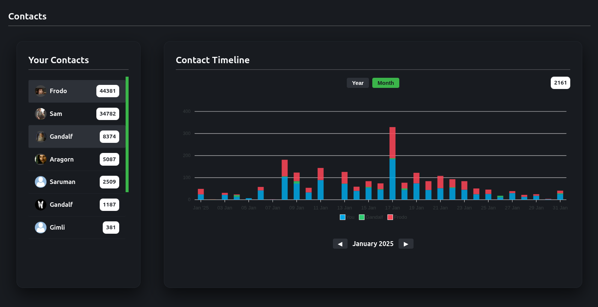

# Threema Chat Analyzer

<p align="center">
  
</p>

<p align="center">
  <a href="https://github.com/maxiking445/threema-chat-analyzer/actions/workflows/release_version.yml">
    
  </a>
  
  
</p>

---
## Supported Versions
This tool has been tested and developed for Android/Threema exports.  IOS users are welcome to report whether the data export can be extracted and works or not. 

Versions:
- 6.3
## About

Threema Chat Analyzer is a tool for analyzing exported Threema chats. I know many people are skeptical of tools like this, but I enjoy exploring data—and even more so when it’s my own. Unlike WhatsApp, which doesn’t make it easy to access your backups, Threema lets you freely create and use them, which makes analysis possible and actually I enjoy it so see trends when I write more or less during the year. So I hope you will like it too! 
<p align="center">
 
</p>

<p align="center">
  
</p>
  
FEATURES:
- Contact statistics (count)
- Group statistics (count)
- Wordcloud ( most used words)
- Offline analysis (your data is safe)

TODO:
- execute backend logic inside browser
- add analysis of single contact (chat frequency, answertime, ...)
- add chat search interface
- script to anonymze data
- suggestions are welcome

---

## How To Use

### How to export Data from Threema?
Detailed explanation how to create a data backup: [Threema Data Backup FAQ](https://threema.com/de/faq/data-backup)

### Via Docker (recommended)
Execute this to start frontend app in your selfhosted environment or local machine which runs docker.

 ```bash
docker run -d -p 5670:80 --name threema-chat-analyzer ghcr.io/maxiking445/threema-chat-analyzer:latest
```
You can now open [http://localhost:9090](http://localhost:5670)
### Build yourself 

 ```bash
docker build -t threema-chat-analyzer:latest .
docker compose up
```

### Start without Docker

Linux (it will install go and node)
 ```bash
sudo ./start_application_linux.sh
```
